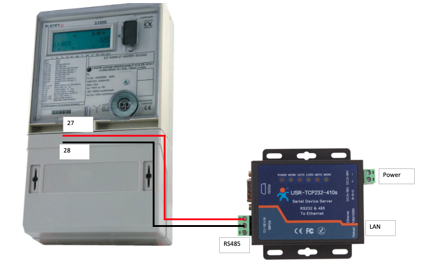
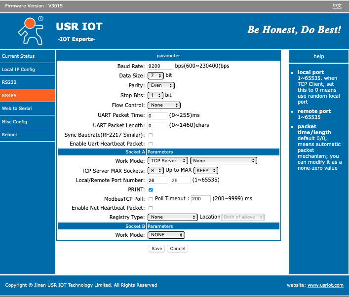
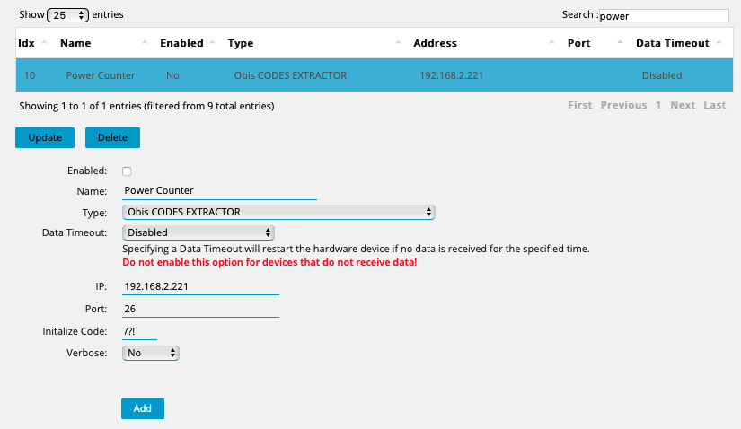
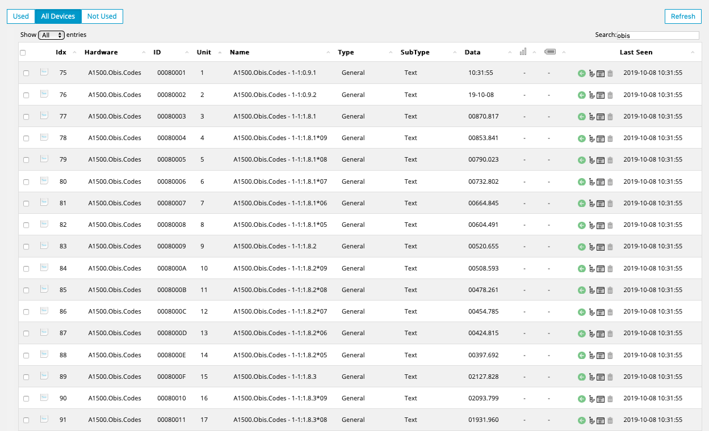

# Domoticz-OBIS-Codes-Extractor
Domoticz Plugin to extracting OBIS CODES values from Power Meters

This plugin only helping to extracting data from Power meters
All new device are creating as a text.
You have to make your on lua script, use value from obis text device and update dummy devices to 
have chars.

Installation:  
cd ~/domoticz/plugins  
git clone https://github.com/MFxMF/Domoticz-OBIS-Codes-Extractor  
sudo pip3 install telnetlib3  
 
Restart your domoticz server.  

Used python modules:  
telnetlib3 -> https://telnetlib3.readthedocs.io 

 

Tested on domoticz 4.10717 

 
 

<h1>SETUP</H1>

Connection RS485 to LAN conventer to the Power Meter

 
 

<h2>Setup RS485 to Lan Conventer </h2> 

Conventer Home page -> https://www.usriot.com/products/modbus-serial-to-ethernet-converters.html 

  

 
 

<h2>Connection TEST </h2> 
pi@raspberry:~$ telnet 192.168.2.221 26 
Trying 192.168.2.221... 
Connected to 192.168.2.221. 
Escape character is '^]'. 
/?! 
/ABB5\@V4.50          
1-1:C.1.0(1312321) 
1-1:0.9.1(10:43:51) 
1-1:0.9.2(19-10-06) 
1-1:1.8.1(00870.918*kWh) 
1-1:1.8.1*09(00853.841*kWh) 
1-1:1.8.1*08(00790.023*kWh) 
1-1:1.8.1*07(00732.802*kWh) 
1-1:1.8.1*06(00664.845*kWh) 
1-1:1.8.1*05(00604.491*kWh) 
1-1:1.8.2(00520.655*kWh) 
1-1:1.8.2*09(00508.593*kWh) 
1-1:1.8.2*08(00478.261*kWh) 
1-1:1.8.2*07(00454.785*kWh) 
1-1:1.8.2*06(00424.815*kWh) 
1-1:1.8.2*05(00397.692*kWh) 
1-1:1.8.3(02127.828*kWh) 
1-1:1.8.3*09(02093.799*kWh) 
1-1:1.8.3*08(01931.960*kWh) 
1-1:1.8.3*07(01796.433*kWh) 
1-1:1.8.3*06(01628.924*kWh) 
1-1:1.8.3*05(01459.285*kWh) 
1-1:1.8.0(03519.402*kWh) 
1-1:1.8.0*09(03456.235*kWh) 
1-1:1.8.0*08(03200.245*kWh) 
1-1:1.8.0*07(02984.021*kWh) 
1-1:1.8.0*06(02718.585*kWh) 
1-1:1.8.0*05(02461.470*kWh) 
1-1:5.8.1(00181.688*kvarh) 
1-1:5.8.1*09(00178.204*kvarh) 
1-1:5.8.1*08(00163.258*kvarh) 
1-1:5.8.1*07(00149.054*kvarh) 
1-1:5.8.1*06(00133.048*kvarh) 
1-1:5.8.1*05(00118.831*kvarh) 
1-1:5.8.2(00112.636*kvarh) 
1-1:5.8.2*09(00110.163*kvarh) 
1-1:5.8.2*08(00102.996*kvarh) 
1-1:5.8.2*07(00096.784*kvarh) 
1-1:5.8.2*06(00089.491*kvarh) 
1-1:5.8.2*05(00083.043*kvarh) 
1-1:5.8.3(00406.531*kvarh) 
1-1:5.8.3*09(00401.129*kvarh) 
1-1:5.8.3*08(00368.797*kvarh) 
1-1:5.8.3*07(00339.454*kvarh) 
1-1:5.8.3*06(00303.322*kvarh) 
1-1:5.8.3*05(00263.973*kvarh) 
1-1:5.8.0(00700.856*kvarh) 
1-1:5.8.0*09(00689.497*kvarh) 
1-1:5.8.0*08(00635.052*kvarh) 
1-1:5.8.0*07(00585.292*kvarh) 
1-1:5.8.0*06(00525.862*kvarh) 
1-1:5.8.0*05(00465.848*kvarh) 
1-1:8.8.1(00000.000*kvarh) 
1-1:8.8.1*09(00000.000*kvarh) 
1-1:8.8.1*08(00000.000*kvarh) 
1-1:8.8.1*07(00000.000*kvarh) 
1-1:8.8.1*06(00000.000*kvarh) 
1-1:8.8.1*05(00000.000*kvarh) 
1-1:8.8.2(00000.000*kvarh) 
1-1:8.8.2*09(00000.000*kvarh) 
1-1:8.8.2*08(00000.000*kvarh) 
1-1:8.8.2*07(00000.000*kvarh) 
1-1:8.8.2*06(00000.000*kvarh) 
1-1:8.8.2*05(00000.000*kvarh) 
1-1:8.8.3(00000.401*kvarh) 
1-1:8.8.3*09(00000.390*kvarh) 
1-1:8.8.3*08(00000.386*kvarh) 
1-1:8.8.3*07(00000.351*kvarh) 
1-1:8.8.3*06(00000.339*kvarh) 
1-1:8.8.3*05(00000.339*kvarh) 
1-1:8.8.0(00000.401*kvarh) 
1-1:8.8.0*09(00000.390*kvarh) 
1-1:8.8.0*08(00000.387*kvarh) 
1-1:8.8.0*07(00000.351*kvarh) 
1-1:8.8.0*06(00000.339*kvarh) 
1-1:8.8.0*05(00000.339*kvarh) 
1-1:1.6.0(0.552*kW)(19-10-06,08:45) 
1-1:1.6.0*09(0.577*kW)(19-09-18,09:15) 
1-1:1.6.0*08(0.586*kW)(19-08-29,12:45) 
1-1:1.6.0*07(0.592*kW)(19-07-18,09:30) 
1-1:1.6.0*06(0.603*kW)(19-06-28,11:00) 
1-1:1.6.0*05(0.556*kW)(19-05-07,07:45) 
1-1:1.2.1(008.090*kW) 
1-1:1.2.1*09(008.090*kW) 
1-1:1.2.1*08(007.513*kW) 
1-1:1.2.1*07(006.927*kW) 
1-1:1.2.1*06(006.335*kW) 
1-1:1.2.1*05(005.732*kW) 
1-1:1.4.0(013)(0.474*kW) 
1-1:1.5.0(0.500*kW) 
1-1:0.1.0(14) 
1-1:0.1.2*09(19-10-01,00:00) 
1-1:0.1.2*08(19-09-01,00:00) 
1-1:0.1.2*07(19-08-01,00:00) 
1-1:0.1.2*06(19-07-01,00:00) 
1-1:0.1.2*05(19-06-01,00:00) 
1-1:0.1.3*09(00:00)(00000000,00000000) 
1-1:0.1.3*08(00:00)(00000000,00000000) 
1-1:0.1.3*07(00:00)(00000000,00000000) 
1-1:0.1.3*06(00:00)(00000000,00000000) 
1-1:0.1.3*05(00:00)(00000000,00000000) 
1-1:0.9.0(07) 
1-1:C.61(19-10-01) 
1-1:83.8.3(143.517*kWh) 
1-1:83.8.6(112802*kWh) 
1-1:32.7.0(60.1*V) 
1-1:52.7.0(59.8*V) 
1-1:72.7.0(60.3*V) 
1-1:31.7.0(3.068*A) 
1-1:51.7.0(2.789*A) 
1-1:71.7.0(2.719*A) 
1-1:1.7.0(0.488*kW) 
1-1:3.7.0(0.121*kvar) 
1-1:4.7.0(0.000*kvar) 
1-1:13.7.0(0.97) 
1-1:F.F(00000000) 
1-1:F.F.1(00000000) 
1-1:F.F.2(00000000) 
1-1:F.F.3(00000000) 
1-1:C.7.0(0001) 
1-1:C.7.1(0000) 
1-1:C.7.2(0002) 
1-1:C.7.3(0000) 
1-1:C.52(19-09-05,08:08) 
1-1:C.53(08:08) 
1-1:C.54(19-09-05,12:12) 
1-1:C.55(12:12) 
1-1:C.56(0000.04.04) 
1-1:C.7.4(00) 
1-1:C.77.0*01(19-09-04,08:08,19-09-04,12:12) 
1-1:C.77.0*02(19-06-29,15:21,19-06-29,15:21) 
1-1:C.77.0*03(18-08-25,15:13,18-08-25,15:13) 
1-1:C.77.0*04(18-08-10,15:14,18-08-10,15:14) 
1-1:C.3.0(00000000) 
1-1:C.4.0(00C00088) 
1-1:C.5.0(0020C0F0) 
1-1:C.60(19-10-06) 
1-1:C.2.0(02) 
! 

<h2>Domoticz Setup </h2> 
  

After setup domoticz plugin on the Domoticz Devices a new idx should be created 
  

